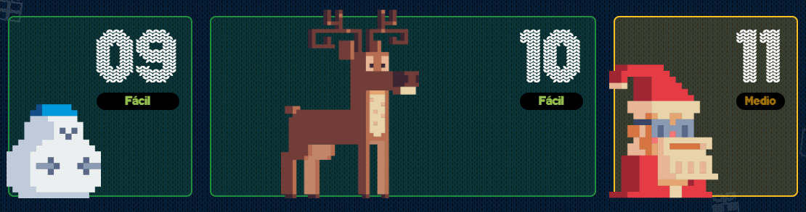

# AdventJS

<!-- Descripción -->
El **[AdventJS](https://adventjs.dev/es)** es una serie de retos de programación para poner en práctica y mejorar la lógica al resolver problemas. El evento nace partiendo de la tradición de ***calendarios de adviento*** y es por ello que, consta de **25** retos enfocados en ser desarrollados con el lenguaje de programación **JavaScript**, aunque, los retos no son ajenos a ser resueltos con un lenguaje de programación diferente a **js**.

<!-- Línea -->

<!-- Imagen del adventjs 2023 -->

<!-- Nota -->
> El `AdventJS` es una iniciativa del desarrollador web **Miguel Ángel Durán**, más conocido como  **[midudev](https://www.youtube.com/c/midudev)**

<!-- Tabla -->
 

| Ejercicio | Ingredientes para resolver el ejercicio | Año |
|---|---|---|
| `1` | Para resolver el reto es necesario un `set`, junto con un ciclo `for` y un condicional `if`| 2023 |
| `2` | Para resolver el reto es necesario un `array`, un par de ciclos `for`, un par de condicionales `if` y una `bandera` o `booleano` | 2023 |
| `3` | xxx | xxx |
| `4` | xxx | xxx |
| `5` | xxx | xxx |
| `6` | xxx | xxx |
| `7` | xxx | xxx |
| `8` | xxx | xxx |
| `9` | xxx | xxx |
| `10` | xxx | xxx |
| `11` | xxx | xxx |
| `12` | xxx | xxx |
| `13` | xxx | xxx |
| `14` | xxx | xxx |
| `15` | xxx | xxx |
| `16` | xxx | xxx |
| `17` | xxx | xxx |
| `18` | xxx | xxx |
| `19` | xxx | xxx |
| `20` | xxx | xxx |
| `21` | xxx | xxx |
| `22` | xxx | xxx |
| `23` | xxx | xxx |
| `24` | xxx | xxx |
| `25` | xxx | xxx |

<h3 align="center">< seandsun /></h3>